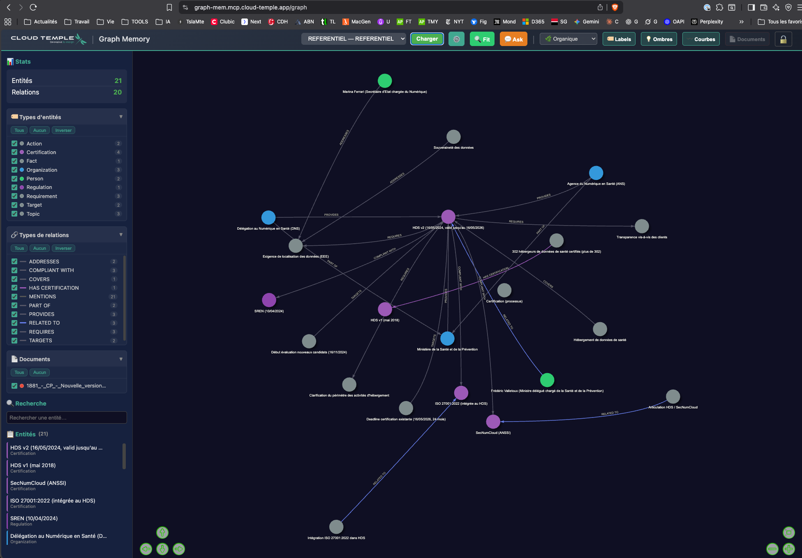
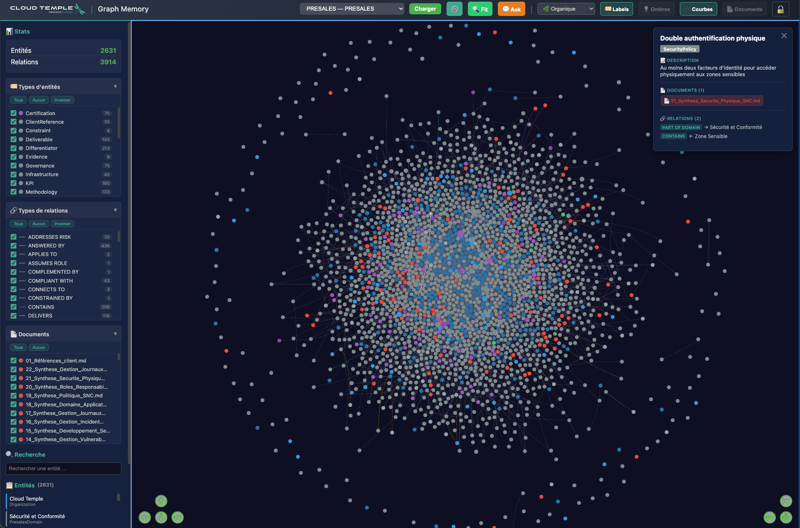
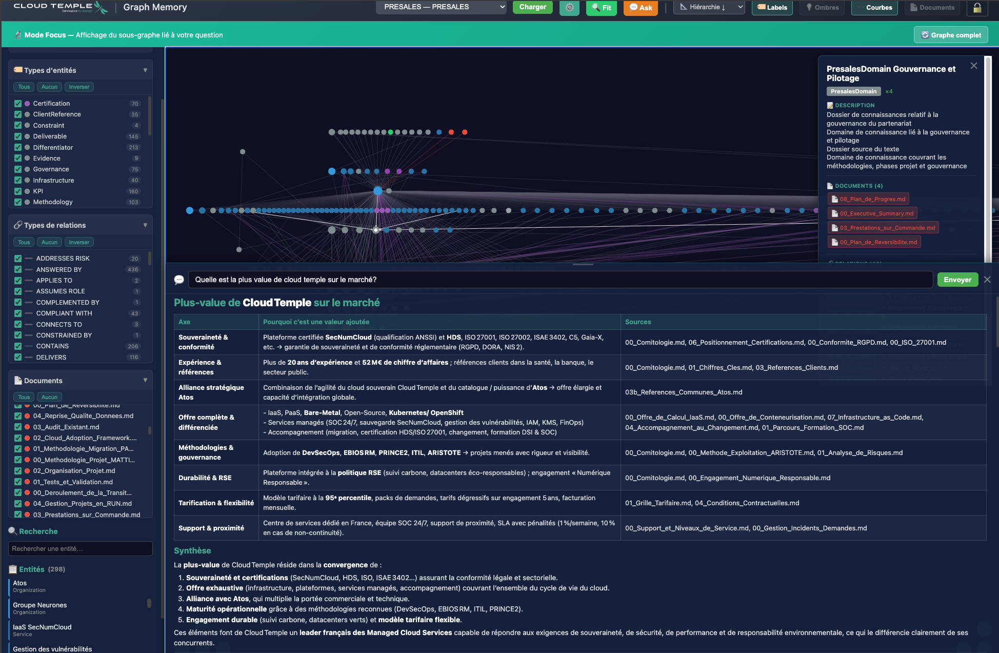
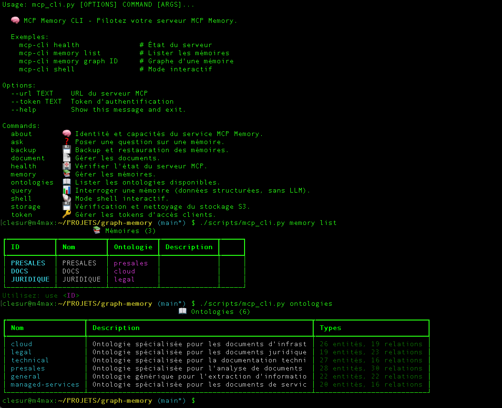

# 🧠 Graph Memory — MCP Knowledge Graph Service


> 🇬🇧 [English version](README.en.md)
Service de mémoire persistante basé sur un **graphe de connaissances** pour les agents IA, implémenté avec le protocole [MCP (Model Context Protocol)](https://modelcontextprotocol.io/).

Développé par **[Cloud Temple](https://www.cloud-temple.com)**.

<p align="center">
  
</p>

---

## 📋 Table des matières

- [Captures d'écran](#-captures-décran)

- [Changelog](#-changelog)
- [Concept](#-concept)
- [Fonctionnalités](#-fonctionnalités)
- [Architecture](#-architecture)
- [Prérequis](#-prérequis)
- [Installation](#-installation)
- [Configuration](#-configuration)
- [Démarrage](#-démarrage)
- [Interface Web](#-interface-web)
- [CLI (Command Line Interface)](#-cli-command-line-interface)
- [Outils MCP](#-outils-mcp)
- [Ontologies](#-ontologies)
- [API REST](#-api-rest)
- [Intégration MCP](#-intégration-mcp)
- [Sécurité](#-sécurité)
- [Structure du projet](#-structure-du-projet)
- [Dépannage](#-dépannage)
- [Licence](#-licence)

---

## 📸 Captures d'écran

<table>
  <tr>
    <td align="center" width="50%">
      <br>
      <b>Graphe interactif</b> — Visualisation du graphe de connaissances avec filtrage par types d'entités et de relations
    </td>
    <td align="center" width="50%">
      <br>
      <b>Panneau ASK</b> — Question en langage naturel avec réponse LLM, citations et mode Focus
    </td>
  </tr>
  <tr>
    <td align="center" width="50%">
      <br>
      <b>Vue d'ensemble</b> — Entités colorées par type, relations inter-documents, sidebar de filtrage
    </td>
    <td align="center" width="50%">
      <br>
      <b>CLI interactive</b> — Shell avec autocomplétion, progression temps réel, affichage Rich
    </td>
  </tr>
</table>

---

## 📋 Changelog

Voir **[CHANGELOG.md](CHANGELOG.md)** pour l'historique complet des versions (v0.5.0 → v1.6.0).

**Dernière version** : v1.6.0 (11 mars 2026) — Isolation multi-tenant durcie (14 failles corrigées), promotion admin déléguée, recette complète 119 tests.

---

## 🎯 Concept

L'approche **Graph-First** : au lieu du RAG vectoriel classique (embedding → similitude cosinus), ce service extrait des **entités** et **relations** structurées via un LLM pour construire un graphe de connaissances interrogeable.

```
╔══════════════════════════════════════════════════════════════╗
║  INGESTION                                                   ║
╚══════════════════════════════════════════════════════════════╝
Document (PDF, DOCX, MD, TXT, HTML, CSV)
    │
    ├──▶ Upload S3 (stockage pérenne)
    │
    ├──▶ Extraction LLM guidée par ontologie
    │    └──▶ Entités + Relations typées → Graphe Neo4j
    │
    └──▶ Chunking sémantique + Embedding BGE-M3
         └──▶ Vecteurs → Qdrant (base vectorielle)

╔══════════════════════════════════════════════════════════════╗
║  QUESTION / RÉPONSE (Graph-Guided RAG)                       ║
╚══════════════════════════════════════════════════════════════╝
Question en langage naturel
    │
    ▼ 1. Recherche d'entités dans le graphe Neo4j
    │
    ├── Entités trouvées ? ──▶ Graph-Guided RAG
    │   │  Le graphe identifie les documents pertinents,
    │   │  puis Qdrant recherche les chunks DANS ces documents.
    │   └──▶ Contexte ciblé (graphe + chunks filtrés)
    │
    └── 0 entités ? ──▶ RAG-only (fallback)
        │  Qdrant recherche dans TOUS les chunks de la mémoire.
        └──▶ Contexte large (chunks seuls)
    │
    ▼ 2. Filtrage par seuil de pertinence (score cosinus ≥ 0.58)
    │    Les chunks non pertinents sont éliminés.
    │
    ▼ 3. LLM génère la réponse avec citations des documents sources
```

### Pourquoi un graphe plutôt que du RAG vectoriel ?

| Critère             | RAG vectoriel                       | Graph Memory                         |
| ------------------- | ----------------------------------- | ------------------------------------ |
| **Précision**       | Similitude sémantique approximative | Relations explicites et typées       |
| **Traçabilité**     | Chunks anonymes                     | Entités nommées + documents sources  |
| **Exploration**     | Recherche unidirectionnelle         | Navigation multi-hop dans le graphe  |
| **Visualisation**   | Difficile                           | Graphe interactif natif              |
| **Multi-documents** | Mélange de chunks                   | Relations inter-documents explicites |

---

## ✨ Fonctionnalités

### Extraction intelligente
- Extraction d'entités et relations guidée par **ontologie** (6 ontologies : legal, cloud, managed-services, presales, general, software-development)
- Support des formats : **PDF, DOCX, Markdown, TXT, HTML, CSV**
- Déduplication par hash SHA-256 (avec option `--force` pour ré-ingérer)
- Instructions anti-hub pour éviter les entités trop génériques

### Graphe de connaissances
- Stockage Neo4j avec **isolation par namespace** (multi-tenant)
- Relations typées (pas de `RELATED_TO` générique avec l'ontologie `legal`)
- Entités liées à leurs documents sources (`MENTIONS`)
- Recherche par tokens avec stop words français

### Question/Réponse (Graph-Guided RAG)
- **Graph-Guided RAG** : le graphe identifie les documents pertinents, puis Qdrant recherche les chunks *dans* ces documents — contexte précis et ciblé
- **Fallback RAG-only** : si le graphe ne trouve rien, recherche vectorielle sur tous les chunks de la mémoire
- **Seuil de pertinence** (`RAG_SCORE_THRESHOLD=0.58`) : les chunks sous le seuil cosinus sont éliminés — pas de bruit envoyé au LLM
- **Citation des documents sources** dans les réponses (chaque entité inclut son document d'origine)
- Mode Focus : isolation du sous-graphe lié à une question

### Interface web interactive
- Visualisation du graphe avec [vis-network](https://visjs.github.io/vis-network/docs/network/)
- Filtrage avancé par types d'entités, types de relations, documents
- Panneau ASK intégré avec rendu Markdown (tableaux, listes, code)
- Mode Focus Question : isole le sous-graphe pertinent après une question

### CLI complète
- **Mode Click** (scriptable) : `python scripts/mcp_cli.py memory list`
- **Mode Shell** (interactif) : autocomplétion, historique, commandes contextuelles

### Sécurité
- Authentification Bearer Token pour toutes les requêtes MCP
- Clé bootstrap pour le premier token + **promotion admin déléguée** (v1.6.0)
- **Isolation multi-tenant durcie** (v1.6.0) : chaque token ne voit/modifie que ses mémoires autorisées
- Isolation des données par mémoire (namespace Neo4j)
- **14 contrôles d'accès** sur les 28 outils MCP (access, write, admin)
- **Recette automatisée** : 119 tests × 3 profils (admin, read/write, read-only)

---

## 🏗️ Architecture

```
┌──────────────────────────────────────────────────────────────────────┐
│                         Clients MCP                                  │
│   (Claude Desktop, Cline, QuoteFlow, Vela, CLI, Interface Web)       │
└──────────────────────────────┬───────────────────────────────────────┘
                               │ Streamable HTTP + Bearer Token
                               ▼
┌──────────────────────────────────────────────────────────────────────┐
│              Coraza WAF (Port 8080 — seul port exposé)               │
│  OWASP CRS • CSP • HSTS • X-Frame-Options • Let's Encrypt (prod)     │
└──────────────────────────────┬───────────────────────────────────────┘
                               │ réseau Docker interne (mcp-network)
                               ▼
┌──────────────────────────────────────────────────────────────────────┐
│                    Graph Memory Service (Port 8002 interne)          │
│  ┌────────────────────────────────────────────────────────────────┐  │
│  │  Middleware Layer                                              │  │
│  │  • StaticFilesMiddleware (web UI + API REST)                   │  │
│  │  • LoggingMiddleware (debug)                                   │  │
│  │  • AuthMiddleware (Bearer Token)                               │  │
│  └────────────────────────────────────────────────────────────────┘  │
│  ┌────────────────────────────────────────────────────────────────┐  │
│  │  MCP Tools (28 outils)                                         │  │
│  │  • memory_create/delete/list/stats                             │  │
│  │  • memory_ingest/search/get_context                            │  │
│  │  • question_answer / memory_query                              │  │
│  │  • document_list/get/delete                                    │  │
│  │  • backup_create/list/restore/download/delete/restore_archive  │  │
│  │  • storage_check/storage_cleanup                               │  │
│  │  • admin_create_token/list_tokens/revoke_token/update_token    │  │
│  │  • ontology_list • system_health                               │  │
│  └────────────────────────────────────────────────────────────────┘  │
│  ┌────────────────────────────────────────────────────────────────┐  │
│  │  Core Services                                                 │  │
│  │  • GraphService (Neo4j)    • StorageService (S3)               │  │
│  │  • ExtractorService (LLM)  • TokenManager (Auth)               │  │
│  │  • EmbeddingService (BGE)  • VectorStoreService (Qdrant)       │  │
│  │  • SemanticChunker         • BackupService (Backup/Restore)    │  │
│  └────────────────────────────────────────────────────────────────┘  │
└──────────────────────────────┬───────────────────────────────────────┘
                               │
        ┌────────────┬─────────┼─────────┬────────────┐
        ▼            ▼         ▼         ▼            ▼
┌───────────┐ ┌───────────┐ ┌──────┐ ┌─────────┐ ┌──────────┐
│  Neo4j 5  │ │ S3 (Dell  │ │LLMaaS│ │ Qdrant  │ │Embedding │
│ (Graphe)  │ │ ECS,AWS…) │ │(Gen) │ │(Vector) │ │(BGE-M3)  │
│ (interne) │ └───────────┘ └──────┘ │(interne)│ │(LLMaaS)  │
└───────────┘                        └─────────┘ └──────────┘
```

> **Sécurité réseau** : seul le port 8080 (WAF) est exposé. Neo4j, Qdrant et le service MCP ne sont accessibles que via le réseau Docker interne. Le container MCP tourne en utilisateur non-root.

---

## 📦 Prérequis

- **Docker** & **Docker Compose** (v2+)
- **Python 3.11+** (pour la CLI, optionnel)
- Un **stockage S3** compatible (Cloud Temple, AWS, MinIO, Dell ECS)
- Un **LLM** compatible OpenAI API (Cloud Temple LLMaaS, OpenAI, etc.)

---

## 🚀 Installation

```bash
# Cloner le dépôt
git clone https://github.com/chrlesur/graph-memory.git
cd graph-memory

# Copier la configuration
cp .env.example .env
```

---

## ⚙️ Configuration

Éditez le fichier `.env` avec vos valeurs. Toutes les variables sont documentées dans `.env.example`.

### Variables obligatoires

| Variable               | Description                          |
| ---------------------- | ------------------------------------ |
| `S3_ENDPOINT_URL`      | URL de l'endpoint S3                 |
| `S3_ACCESS_KEY_ID`     | Clé d'accès S3                       |
| `S3_SECRET_ACCESS_KEY` | Secret S3                            |
| `S3_BUCKET_NAME`       | Nom du bucket                        |
| `LLMAAS_API_URL`       | URL de l'API LLM (compatible OpenAI) |
| `LLMAAS_API_KEY`       | Clé d'API LLM                        |
| `NEO4J_PASSWORD`       | Mot de passe Neo4j                   |
| `ADMIN_BOOTSTRAP_KEY`  | Clé pour créer le premier token      |

### Variables optionnelles (avec valeurs par défaut)

| Variable                     | Défaut         | Description                                           |
| ---------------------------- | -------------- | ----------------------------------------------------- |
| `LLMAAS_MODEL`               | `gpt-oss:120b` | Modèle LLM                                            |
| `LLMAAS_MAX_TOKENS`          | `60000`        | Max tokens par réponse                                |
| `LLMAAS_TEMPERATURE`         | `1.0`          | Température (gpt-oss:120b requiert 1.0)               |
| `EXTRACTION_MAX_TEXT_LENGTH` | `950000`       | Max caractères envoyés au LLM                         |
| `MCP_SERVER_PORT`            | `8002`         | Port d'écoute                                         |
| `MCP_SERVER_DEBUG`           | `false`        | Logs détaillés                                        |
| `MAX_DOCUMENT_SIZE_MB`       | `50`           | Taille max documents                                  |
| `RAG_SCORE_THRESHOLD`        | `0.58`         | Score cosinus min. pour un chunk RAG BGE-M3 (0.0-1.0) |
| `RAG_CHUNK_LIMIT`            | `8`            | Nombre max de chunks retournés par Qdrant             |
| `CHUNK_SIZE`                 | `500`          | Taille cible en tokens par chunk                      |
| `CHUNK_OVERLAP`              | `50`           | Tokens de chevauchement entre chunks                  |

Voir `.env.example` pour la liste complète.

---

## ▶️ Démarrage

```bash
# Démarrer les services (WAF + MCP + Neo4j + Qdrant)
docker compose up -d

# Vérifier le statut
docker compose ps

# Vérifier la santé (via le WAF)
curl http://localhost:8080/health

# Voir les logs
docker compose logs mcp-memory -f --tail 50
docker compose logs waf -f --tail 50
```

### Ports exposés

| Service    | Port   | Description                                              |
| ---------- | ------ | -------------------------------------------------------- |
| **WAF**    | `8080` | **Seul port exposé** — Coraza WAF → Graph Memory         |
| Neo4j      | —      | Réseau Docker interne uniquement (debug: 127.0.0.1:7475) |
| Qdrant     | —      | Réseau Docker interne uniquement (debug: 127.0.0.1:6333) |
| MCP Server | —      | Réseau Docker interne uniquement (debug: 127.0.0.1:8002) |

> **Production HTTPS** : mettez `SITE_ADDRESS=votre-domaine.com` dans `.env`, décommentez les ports 80+443 dans `docker-compose.yml`. Caddy obtient automatiquement un certificat Let's Encrypt.

---

## 🌐 Interface Web

Accessible à : **http://localhost:8080/graph**

### Fonctionnalités

- **Sélecteur de mémoire** : choisissez une mémoire et chargez son graphe
- **Graphe interactif** : zoom, drag, clic sur les nœuds pour voir les détails
- **Filtrage avancé** (sidebar gauche) :
  - 🏷️ **Types d'entités** : checkboxes avec pastilles couleur, compteurs
  - 🔗 **Types de relations** : checkboxes avec barres couleur
  - 📄 **Documents** : masquer/afficher par document source
  - Actions batch : Tous / Aucun / Inverser pour chaque filtre
- **Panneau ASK** (💬) : posez une question en langage naturel
  - Réponse LLM avec citations des documents sources
  - Rendu Markdown complet (tableaux, listes, code)
  - Entités cliquables → focus sur le nœud dans le graphe
- **Mode Focus** (🔬) : isole le sous-graphe lié aux entités de la réponse
  - Sortie automatique du mode Focus lors d'une nouvelle question (pas de filtrage résiduel)
- **Toggle MENTIONS** (📄) : masque/affiche les nœuds Document et les liens MENTIONS pour ne voir que les relations sémantiques
- **Modale paramètres** (⚙️) : ajustez la physique du graphe (distance, répulsion, taille)
- **Recherche locale** : filtrez les entités par texte dans la sidebar
- **Bouton Fit** (🔍) : recentre la vue sur tout le graphe

---

## 💻 CLI (Command Line Interface)

### Installation des dépendances CLI

```bash
pip install httpx click rich prompt_toolkit mcp
```

### Mode Click (scriptable)

```bash
# Point d'entrée
python scripts/mcp_cli.py [COMMANDE] [OPTIONS]

# Exemples
python scripts/mcp_cli.py health
python scripts/mcp_cli.py memory list
python scripts/mcp_cli.py memory create JURIDIQUE -n "Corpus Juridique" -d "Documents contractuels" -o legal
python scripts/mcp_cli.py document ingest JURIDIQUE /path/to/contrat.docx
python scripts/mcp_cli.py ask JURIDIQUE "Quelles sont les conditions de résiliation ?"
python scripts/mcp_cli.py memory entities JURIDIQUE
python scripts/mcp_cli.py memory relations JURIDIQUE -t DEFINES
python scripts/mcp_cli.py ontologies
python scripts/mcp_cli.py storage check JURIDIQUE
```

### Mode Shell (interactif)

```bash
python scripts/mcp_cli.py shell

# Dans le shell :
mcp> list                          # Lister les mémoires
mcp> use JURIDIQUE                 # Sélectionner une mémoire
mcp[JURIDIQUE]> info               # Statistiques
mcp[JURIDIQUE]> docs               # Lister les documents
mcp[JURIDIQUE]> ingest /path/to/doc.pdf  # Ingérer un document
mcp[JURIDIQUE]> entities           # Entités par type
mcp[JURIDIQUE]> entity "Cloud Temple"    # Détail d'une entité
mcp[JURIDIQUE]> relations DEFINES  # Relations par type
mcp[JURIDIQUE]> ask Quelles sont les obligations du client ?
mcp[JURIDIQUE]> graph              # Graphe texte dans le terminal
mcp[JURIDIQUE]> limit 20           # Changer la limite de résultats
mcp> help                          # Aide
mcp> exit                          # Quitter
```

### Tableau complet des commandes

| Fonctionnalité     | CLI Click                       | Shell interactif                                  |
| ------------------ | ------------------------------- | ------------------------------------------------- |
| État serveur       | `health`                        | `health`                                          |
| Lister mémoires    | `memory list`                   | `list`                                            |
| Créer mémoire      | `memory create ID -o onto`      | `create ID onto`                                  |
| Supprimer mémoire  | `memory delete ID`              | `delete [ID]`                                     |
| Info mémoire       | `memory info ID`                | `info`                                            |
| Graphe texte       | `memory graph ID`               | `graph [ID]`                                      |
| Entités par type   | `memory entities ID`            | `entities`                                        |
| Contexte entité    | `memory entity ID NAME`         | `entity NAME`                                     |
| Relations par type | `memory relations ID [-t TYPE]` | `relations [TYPE]`                                |
| Lister documents   | `document list ID`              | `docs`                                            |
| Ingérer document   | `document ingest ID PATH`       | `ingest PATH`                                     |
| Supprimer document | `document delete ID DOC`        | `deldoc DOC`                                      |
| Question/Réponse   | `ask ID "question"`             | `ask question`                                    |
| Query structuré    | `query ID "question"`           | `query question`                                  |
| Vérif. stockage S3 | `storage check [ID]`            | `check [ID]`                                      |
| Nettoyage S3       | `storage cleanup [-f]`          | `cleanup [--force]`                               |
| Ontologies dispo.  | `ontologies`                    | `ontologies`                                      |
| Créer backup       | `backup create ID`              | `backup-create [ID]`                              |
| Lister backups     | `backup list [ID]`              | `backup-list [ID]`                                |
| Restaurer backup   | `backup restore BACKUP_ID`      | `backup-restore BACKUP_ID`                        |
| Télécharger backup | `backup download BACKUP_ID`     | `backup-download BACKUP_ID [--include-documents]` |
| Supprimer backup   | `backup delete BACKUP_ID`       | `backup-delete BACKUP_ID`                         |
| Restore fichier    | `backup restore-file PATH`      | *(via Click uniquement)*                          |

---

## 🔧 Outils MCP

28 outils exposés via le protocole MCP (Streamable HTTP) :

### Gestion des mémoires

| Outil           | Paramètres                                     | Description                                         |
| --------------- | ---------------------------------------------- | --------------------------------------------------- |
| `memory_create` | `memory_id`, `name`, `description`, `ontology` | Crée une mémoire avec ontologie                     |
| `memory_delete` | `memory_id`                                    | Supprime une mémoire (cascade: docs + entités + S3) |
| `memory_list`   | —                                              | Liste toutes les mémoires                           |
| `memory_stats`  | `memory_id`                                    | Statistiques (docs, entités, relations, types)      |
| `memory_graph`  | `memory_id`                                    | Graphe complet (nœuds, arêtes, documents)           |

### Documents

| Outil             | Paramètres                                         | Description                                       |
| ----------------- | -------------------------------------------------- | ------------------------------------------------- |
| `memory_ingest`   | `memory_id`, `content_base64`, `filename`, `force` | Ingère un document (S3 + extraction LLM + graphe) |
| `document_list`   | `memory_id`                                        | Liste les documents d'une mémoire                 |
| `document_get`    | `memory_id`, `filename`, `include_content`         | Métadonnées d'un document (+ contenu optionnel)   |
| `document_delete` | `memory_id`, `filename`                            | Supprime un document et ses entités orphelines    |

### Recherche et Q&A

| Outil                | Paramètres                       | Description                                                |
| -------------------- | -------------------------------- | ---------------------------------------------------------- |
| `memory_search`      | `memory_id`, `query`, `limit`    | Recherche d'entités dans le graphe                         |
| `memory_get_context` | `memory_id`, `entity_name`       | Contexte complet d'une entité (voisins + docs)             |
| `question_answer`    | `memory_id`, `question`, `limit` | Question en langage naturel → réponse LLM avec sources     |
| `memory_query`       | `memory_id`, `query`, `limit`    | Données structurées sans LLM (entités, chunks RAG, scores) |

### Ontologies

| Outil           | Paramètres | Description                      |
| --------------- | ---------- | -------------------------------- |
| `ontology_list` | —          | Liste les ontologies disponibles |

### Stockage S3

| Outil             | Paramètres              | Description                       |
| ----------------- | ----------------------- | --------------------------------- |
| `storage_check`   | `memory_id` (optionnel) | Vérifie cohérence graphe ↔ S3     |
| `storage_cleanup` | `dry_run`               | Nettoie les fichiers S3 orphelins |

### Backup / Restore

| Outil                    | Paramètres                       | Description                                                   |
| ------------------------ | -------------------------------- | ------------------------------------------------------------- |
| `backup_create`          | `memory_id`, `description`       | Crée un backup complet sur S3 (graphe + vecteurs)             |
| `backup_list`            | `memory_id` (optionnel)          | Liste les backups disponibles avec statistiques               |
| `backup_restore`         | `backup_id`                      | Restaure depuis un backup S3 (mémoire ne doit pas exister)    |
| `backup_download`        | `backup_id`, `include_documents` | Télécharge un backup en archive tar.gz (+ docs optionnels)    |
| `backup_delete`          | `backup_id`                      | Supprime un backup de S3                                      |
| `backup_restore_archive` | `archive_base64`                 | Restaure depuis une archive tar.gz locale (avec re-upload S3) |

### Administration

| Outil                | Paramètres                            | Description                                                    |
| -------------------- | ------------------------------------- | -------------------------------------------------------------- |
| `admin_create_token` | `client_name`, `permissions`, `email` | Crée un token d'accès                                          |
| `admin_list_tokens`  | —                                     | Liste les tokens actifs                                        |
| `admin_revoke_token` | `token_hash`                          | Révoque un token                                               |
| `admin_update_token` | `token_hash`, `memory_ids`, `action`  | Modifie les mémoires d'un token (add/remove/set)               |
| `system_health`      | —                                     | État de santé des services (Neo4j, S3, LLM, Qdrant, Embedding) |

---

## 📖 Ontologies

Les ontologies définissent les **types d'entités** et **types de relations** que le LLM doit extraire. Elles sont obligatoires à la création d'une mémoire.

### Ontologies fournies

| Ontologie          | Fichier                            | Entités  | Relations | Usage                                                              |
| ------------------ | ---------------------------------- | -------- | --------- | ------------------------------------------------------------------ |
| `legal`            | `ONTOLOGIES/legal.yaml`            | 22 types | 22 types  | Documents juridiques, contrats                                     |
| `cloud`            | `ONTOLOGIES/cloud.yaml`            | 27 types | 19 types  | Infrastructure cloud, fiches produits, docs techniques             |
| `managed-services` | `ONTOLOGIES/managed-services.yaml` | 20 types | 16 types  | Services managés, infogérance                                      |
| `presales`         | `ONTOLOGIES/presales.yaml`         | 28 types | 30 types  | Avant-vente, RFP/RFI, propositions commerciales                    |
| `general`          | `ONTOLOGIES/general.yaml`          | 24 types | 22 types  | Générique : FAQ, référentiels, certifications, RSE, specs produits |

> Toutes les ontologies utilisent les limites d'extraction `max_entities: 60` / `max_relations: 80`.

### Format d'une ontologie

```yaml
name: legal
description: Ontologie pour documents juridiques
version: "1.0"

entity_types:
  - name: Article
    description: Article numéroté d'un contrat
  - name: Clause
    description: Clause contractuelle spécifique
  - name: Partie
    description: Partie signataire d'un contrat
  # ...

relation_types:
  - name: DEFINES
    description: Définit un concept ou une obligation
  - name: APPLIES_TO
    description: S'applique à une entité
  - name: REFERENCES
    description: Fait référence à un autre élément
  # ...

instructions: |
  Instructions spécifiques pour le LLM lors de l'extraction.
```

### Créer une ontologie personnalisée

1. Créez un fichier YAML dans `ONTOLOGIES/`
2. Définissez les types d'entités et relations pertinents
3. Ajoutez des instructions spécifiques si nécessaire
4. Créez la mémoire : `python scripts/mcp_cli.py memory create MON_ID -o mon_ontologie`

---

## 🌍 API REST

En plus du protocole MCP (Streamable HTTP), le service expose une API REST. **Tous les endpoints `/api/*` requièrent un Bearer Token** (même header `Authorization` que pour MCP). Seuls `/health` et les fichiers statiques (`/graph`, `/static/`) sont publics.

### Endpoints publics (pas d'authentification)

| Méthode | Endpoint    | Description                    |
| ------- | ----------- | ------------------------------ |
| `GET`   | `/health`   | État de santé du serveur       |
| `GET`   | `/graph`    | Interface web de visualisation |
| `GET`   | `/static/*` | Fichiers statiques (CSS, JS)   |

### Endpoints authentifiés (Bearer Token obligatoire)

| Méthode | Endpoint                 | Description                                               |
| ------- | ------------------------ | --------------------------------------------------------- |
| `GET`   | `/api/memories`          | Liste des mémoires (JSON)                                 |
| `GET`   | `/api/graph/{memory_id}` | Graphe complet d'une mémoire (JSON)                       |
| `POST`  | `/api/ask`               | Question/Réponse via LLM (JSON)                           |
| `POST`  | `/api/query`             | Interrogation structurée sans LLM — données brutes (JSON) |

> **Note** : Le client web (`/graph`) stocke le token Bearer en `localStorage` et l'injecte automatiquement dans chaque appel `/api/*`. En cas de 401, un écran de login s'affiche.

### Exemple : Question/Réponse via API REST

```bash
curl -X POST http://localhost:8080/api/ask \
  -H "Authorization: Bearer VOTRE_TOKEN" \
  -H "Content-Type: application/json" \
  -d '{
    "memory_id": "JURIDIQUE",
    "question": "Quelles sont les conditions de résiliation ?",
    "limit": 10
  }'
```

Réponse :
```json
{
  "status": "ok",
  "answer": "## Conditions de résiliation\n\n| Condition | Détail | Source(s) |\n|...",
  "entities": ["30 jours (préavis)", "Article 15 – Résiliation"],
  "source_documents": [
    {"filename": "CGA.docx", "uri": "s3://..."},
    {"filename": "CGV.docx", "uri": "s3://..."}
  ]
}
```

### Exemple : Query structuré (sans LLM)

```bash
curl -X POST http://localhost:8080/api/query \
  -H "Authorization: Bearer VOTRE_TOKEN" \
  -H "Content-Type: application/json" \
  -d '{
    "memory_id": "JURIDIQUE",
    "query": "réversibilité des données",
    "limit": 10
  }'
```

---

## 🔌 Intégration MCP

### Avec Claude Desktop / Cline

Ajoutez dans votre configuration MCP :

```json
{
  "mcpServers": {
    "graph-memory": {
      "url": "http://localhost:8080/mcp",
      "headers": {
        "Authorization": "Bearer VOTRE_TOKEN"
      }
    }
  }
}
```

### Via Python (client MCP)

```python
from mcp.client.streamable_http import streamablehttp_client
from mcp import ClientSession
import base64

async def exemple():
    headers = {"Authorization": "Bearer votre_token"}
    
    async with streamablehttp_client("http://localhost:8080/mcp", headers=headers) as (read, write, _):
        async with ClientSession(read, write) as session:
            await session.initialize()
            
            # Créer une mémoire
            await session.call_tool("memory_create", {
                "memory_id": "demo",
                "name": "Démo",
                "description": "Mémoire de démonstration",
                "ontology": "legal"
            })
            
            # Ingérer un document
            with open("contrat.pdf", "rb") as f:
                content = base64.b64encode(f.read()).decode()
            
            await session.call_tool("memory_ingest", {
                "memory_id": "demo",
                "content_base64": content,
                "filename": "contrat.pdf"
            })
            
            # Poser une question
            result = await session.call_tool("question_answer", {
                "memory_id": "demo",
                "question": "Quelles sont les obligations du client ?",
                "limit": 10
            })
            print(result)
```

---

## 🔒 Sécurité

### Authentification

- **Protocole MCP** (Streamable HTTP) : Bearer Token obligatoire dans le header `Authorization`
- **API REST** (`/api/*`) : Bearer Token obligatoire (même token que MCP)
- **Interface web** (`/graph`, `/static/*`) : accès public (le JS injecte le token depuis `localStorage`)
- **Requêtes internes** (localhost/127.0.0.1) : exemptées d'authentification pour MCP uniquement (pas pour `/api/*`)
- **Health check** (`/health`) : accès public

### Gestion des tokens

```bash
# Créer un token (via la clé bootstrap admin)
curl -X POST http://localhost:8080/mcp \
  -H "Authorization: Bearer ADMIN_BOOTSTRAP_KEY" \
  # ... appel MCP admin_create_token

# Ou via la CLI
python scripts/mcp_cli.py shell
mcp> # utiliser les commandes d'admin
```

### WAF (Web Application Firewall)

Depuis v0.6.6, un **WAF Coraza** (basé sur Caddy) protège le service :
- **OWASP CRS** : protection contre injections SQL/XSS, path traversal, SSRF, scanners
- **Headers de sécurité** : CSP, X-Frame-Options (DENY), X-Content-Type-Options, Referrer-Policy, Permissions-Policy
- **Rate Limiting** (depuis v1.1.0) : 
  - SSE : 10 connexions/min (longue durée)
  - Messages MCP : 60 appels/min (burst autorisé)
  - API Web : 30 requêtes/min
  - Global : 200 requêtes/min
- **Container non-root** : le service MCP tourne sous l'utilisateur `mcp` (pas root)
- **Réseau isolé** : Neo4j et Qdrant ne sont PAS exposés à l'extérieur
- **TLS automatique** : en production, Caddy obtient et renouvelle les certificats Let's Encrypt

### Bonnes pratiques

1. **Changez `ADMIN_BOOTSTRAP_KEY`** en production
2. **Changez `NEO4J_PASSWORD`** en production
3. Ne commitez jamais le fichier `.env`
4. Créez des tokens avec les permissions minimales nécessaires
5. En production, activez HTTPS via `SITE_ADDRESS=votre-domaine.com`

---

## 📁 Structure du projet

```
graph-memory/
├── .env.example              # Template de configuration (toutes les variables)
├── .gitignore                # Fichiers ignorés
├── docker-compose.yml        # Orchestration Docker (WAF + MCP + Neo4j + Qdrant)
├── Dockerfile                # Image du service (non-root)
├── README.md                 # Ce fichier
├── requirements.txt          # Dépendances Python
│
├── waf/                      # WAF Coraza (reverse proxy sécurisé)
│   └── Caddyfile             # Config OWASP CRS + headers + TLS Let's Encrypt
│
├── ONTOLOGIES/               # Ontologies d'extraction
│   ├── legal.yaml            # Documents juridiques (22 entités, 22 relations)
│   ├── cloud.yaml            # Infrastructure cloud (27 entités, 19 relations) [v1.2]
│   ├── managed-services.yaml # Services managés (20 entités, 16 relations)
│   ├── presales.yaml         # Avant-vente / RFP (28 entités, 30 relations) [v1.3.0]
│   └── general.yaml          # Générique : FAQ, certif, RSE, specs (24 entités, 22 relations) [v1.3.6]
│
├── scripts/                  # CLI et utilitaires
│   ├── mcp_cli.py            # Point d'entrée CLI (Click + Shell)
│   ├── test_recette.py       # Recette complète (119 tests, 7 phases, 3 profils)
│   ├── tests/                # Modules de test modulaires (7 fichiers)
│   ├── README.md             # Documentation CLI
│   ├── view_graph.py         # Visualisation graphe en terminal
│   └── cli/                  # Package CLI
│       ├── __init__.py
│       ├── client.py         # Client Streamable HTTP vers le serveur MCP
│       ├── commands.py       # Commandes Click (interface scriptable)
│       ├── display.py        # Affichage Rich (tables, panels, graphe)
│       └── shell.py          # Shell interactif prompt_toolkit
│
└── src/mcp_memory/           # Code source du service
    ├── __init__.py
    ├── server.py             # Serveur MCP principal (FastMCP + outils)
    ├── config.py             # Configuration centralisée (pydantic-settings)
    │
    ├── auth/                 # Authentification
    │   ├── __init__.py
    │   ├── context.py        # ContextVar pour propager l'auth aux outils MCP
    │   ├── middleware.py     # Middlewares ASGI (Auth + Logging + Static + API REST)
    │   └── token_manager.py  # CRUD tokens dans Neo4j
    │
    ├── core/                 # Services métier
    │   ├── __init__.py
    │   ├── graph.py          # Service Neo4j (requêtes Cypher)
    │   ├── storage.py        # Service S3 (upload/download via boto3)
    │   ├── extractor.py      # Service LLM (extraction d'entités + Q&A)
    │   ├── ontology.py       # Chargement des ontologies YAML
    │   ├── models.py         # Modèles Pydantic (Entity, Document, Memory…)
    │   ├── chunker.py        # SemanticChunker (découpage articles/sections)
    │   ├── embedder.py       # EmbeddingService (BGE-M3 via LLMaaS)
    │   ├── vector_store.py   # VectorStoreService (Qdrant — recherche RAG)
    │   └── backup.py         # BackupService (backup/restore Neo4j + Qdrant + S3)
    │
    ├── tools/                # Outils MCP (enregistrés dans server.py)
    │   └── __init__.py
    │
    └── static/               # Interface web
        ├── graph.html        # Page principale
        ├── css/
        │   └── graph.css     # Styles (thème sombre, couleurs Cloud Temple)
        ├── js/
        │   ├── config.js     # Configuration, couleurs, état de filtrage
        │   ├── api.js        # Appels API REST
        │   ├── graph.js      # Rendu vis-network + mode Focus
        │   ├── sidebar.js    # Filtres, liste d'entités, recherche
        │   ├── ask.js        # Panneau Question/Réponse
        │   └── app.js        # Orchestration et initialisation
        └── img/
            └── logo-cloudtemple.svg
```

---

## 🌉 Intégration avec Live Memory — Architecture mémoire à deux niveaux

Graph Memory s'intègre nativement avec [Live Memory](https://github.com/chrlesur/live-memory), un serveur MCP de mémoire de travail pour agents IA collaboratifs. Ensemble, ils forment une **architecture mémoire à deux niveaux** pour les systèmes multi-agents.

### Pourquoi deux niveaux de mémoire ?

La recherche récente sur les MAS à base de LLM ([Tran et al., 2025 — *Multi-Agent Collaboration Mechanisms*](https://arxiv.org/abs/2501.06322)) identifie la mémoire partagée comme composant fondamental des systèmes collaboratifs. Un seul niveau ne suffit pas :

| Niveau                 | Service      | Durée            | Contenu                                     | Usage                               |
| ---------------------- | ------------ | ---------------- | ------------------------------------------- | ----------------------------------- |
| **Mémoire de travail** | Live Memory  | Session / projet | Notes brutes + bank consolidée Markdown     | Contexte opérationnel quotidien     |
| **Mémoire long terme** | Graph Memory | Permanent        | Entités + relations + embeddings vectoriels | Base de connaissances interrogeable |

```
  Agents IA (Cline, Claude, ...)
       │
       ▼
  ┌─────────────────────┐
  │  Live Memory        │  Notes temps réel → LLM → Memory Bank
  │  (mémoire travail)  │  S3-only, pas de BDD
  └──────────┬──────────┘
             │ graph_push (MCP Streamable HTTP)
             │ delete + re-ingest → recalcul du graphe
             ▼
  ┌──────────────────────┐
  │  Graph Memory        │  Entités + Relations + RAG vectoriel
  │  (mémoire long terme)│  Neo4j + Qdrant + S3
  └──────────────────────┘
```

### Comment ça marche

Live Memory dispose de 4 outils MCP dédiés (`graph_connect`, `graph_push`, `graph_status`, `graph_disconnect`). Le flux :

1. **`graph_connect`** — L'agent connecte son space Live Memory à une mémoire Graph Memory (crée la mémoire si besoin, ontologie paramétrable)
2. **`bank_consolidate`** — Le LLM de Live Memory consolide les notes en fichiers bank Markdown
3. **`graph_push`** — Les fichiers bank sont poussés dans Graph Memory via le protocole MCP Streamable HTTP. Chaque fichier est supprimé puis ré-ingéré pour recalculer le graphe complet
4. **`graph_status`** — Vérifie la connexion et affiche les stats (documents, entités, relations, top entités)

### Résultat

Les fichiers Markdown de la memory bank deviennent des **entités et relations** dans le graphe de connaissances, interrogeables en langage naturel via `question_answer`. Les connaissances de travail des agents sont ainsi pérennisées et structurées.

---

## 🔍 Dépannage

### Le service ne démarre pas

```bash
# Vérifier les logs
docker compose logs mcp-memory --tail 50

# Vérifier que Neo4j est prêt
docker compose logs neo4j --tail 20

# Vérifier la configuration
docker compose exec mcp-memory env | grep -E "S3_|LLMAAS_|NEO4J_"
```

### Erreur 421 Misdirected Request (derrière un reverse proxy)

- **Cause** : le SDK MCP v1.26+ active une protection DNS rebinding quand `host="127.0.0.1"` (défaut). Le `Host` header public est rejeté.
- **Fix** : vérifiez que `FastMCP` est initialisé avec `host="0.0.0.0"` (ou `settings.mcp_server_host`) dans `server.py`. Depuis v1.2.2, c'est le comportement par défaut.
- **Vérification** : `curl -s -o /dev/null -w '%{http_code}' https://votre-domaine/mcp` → ne doit PAS retourner 421.

### Erreur 401 Unauthorized

- Vérifiez que votre token est valide
- Les endpoints publics (`/health`, `/graph`, `/static/*`) ne nécessitent pas de token
- **Tous les `/api/*`** et les requêtes MCP (`/mcp`) nécessitent un Bearer Token

### Page web blanche

- Accédez à `http://localhost:8080/graph` (pas `/` ni `/static/graph.html`)
- Faites un **hard refresh** : `Cmd+Shift+R` (Mac) ou `Ctrl+Shift+R` (Windows)
- Vérifiez les logs : `docker compose logs mcp-memory -f`

### L'extraction est lente ou échoue

- Vérifiez `EXTRACTION_MAX_TEXT_LENGTH` (réduisez pour les modèles avec petite fenêtre de contexte)
- Augmentez `EXTRACTION_TIMEOUT_SECONDS` si le LLM est lent
- Vérifiez les logs pour les erreurs LLM : `docker compose logs mcp-memory | grep "❌"`

### Rebuild après modification du code

```bash
docker compose build mcp-memory && docker compose up -d mcp-memory
```

---

## 📄 Licence

Ce projet est distribué sous licence **Apache 2.0**. Voir le fichier [LICENSE](LICENSE) pour plus de détails.

Développé par **[Cloud Temple](https://www.cloud-temple.com)**.

---

*Graph Memory v1.6.0 — Mars 2026*
